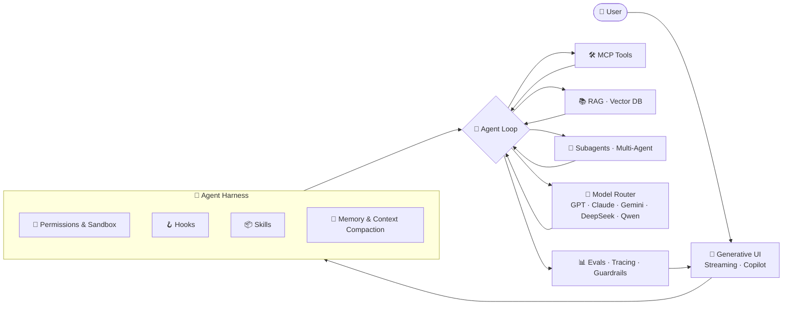
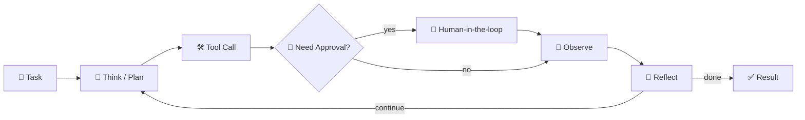
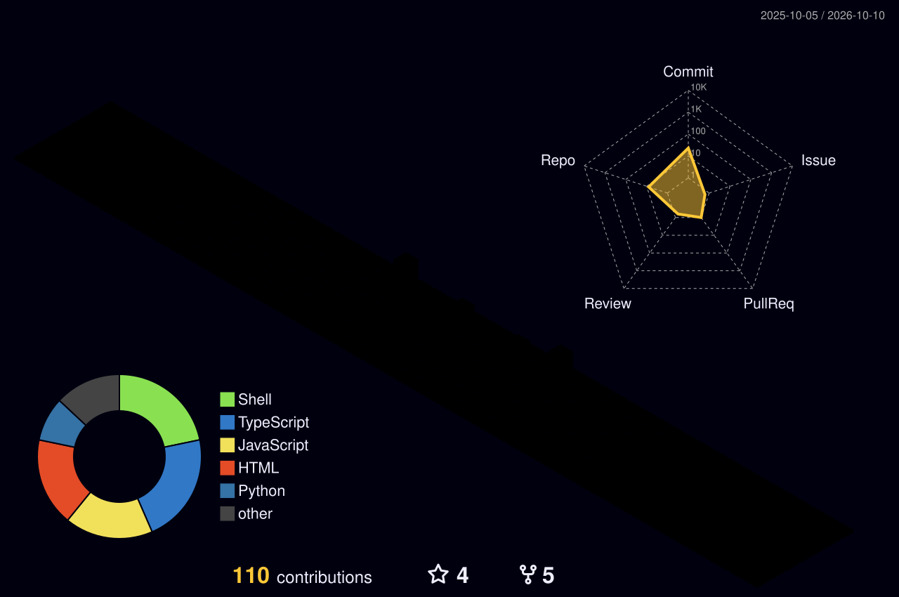

<!-- Header -->
<div align="center">
  
</div>

<div align="center">
  <a href="https://gql.fit/"></a>
</div>

<div align="center">
  <a href="https://gql.fit/"></a>
  <a href="https://github.com/vlinglandy"></a>
  
  
</div>

<br/>

## 🧑🏻‍💻 About Me

```ts
const qingheng: AIEngineer = {
  role: "AI 应用开发工程师 / 资深前端工程师",
  experience: "6+ years of Web Engineering",
  focus: ["AI Agent", "Agent Harness", "Agent Loop", "MCP & Skills", "RAG", "Generative UI"],
  building: [
    "可落地的企业级 AI Agent 平台：工具调用 · 多 Agent 协作 · 长任务自主循环",
    "Agent Harness：权限沙箱 · Hooks · Skills · Memory · Context Compaction",
    "AI-Native 前端：流式渲染 · 生成式 UI · Copilot 交互",
  ],
  frontend: ["React", "Next.js", "Vue", "TypeScript", "Three.js", "工程化", "性能优化", "低代码", "微前端"],
  philosophy: "LLM 是大脑，Harness 是身体，Loop 是生命力 —— 让 AI 真正交付价值。",
};
```

- 🧠 &nbsp;深耕 **LLM 应用与 Agent 工程**：从 Prompt / Context Engineering 到 Tool Use、MCP、Multi-Agent 编排，打通 Agent 从 Demo 到生产的全链路
- 🧩 &nbsp;熟悉 **Agent Harness** 设计：工具注册、权限模式、Hooks 拦截、Skills 按需加载、Subagent 并行委派、上下文自动压缩与长期记忆
- 🔁 &nbsp;构建可靠的 **Agent Loop**：Think → Act → Observe → Reflect 闭环、终止条件、失败重试、Human-in-the-loop 审批与 Eval 评测
- 🎨 &nbsp;**6 年资深前端**：负责过复杂中后台、低代码平台和 3D 可视化项目，在工程化、组件体系、性能优化和线上质量方面有深厚积累
- 🚀 &nbsp;让 AI 能力在前端**以产品形态落地**：流式对话、生成式 UI、AI Copilot、端侧推理（WebLLM / WebGPU）

<br/>

## 🔁 Agent Loop × Harness

<div align="center">
  
</div>

<br/>

## 🛠️ AI Tech Stack

<table>
<tr>
<td align="center" width="160"><b>🧠 大模型 LLMs</b></td>
<td>


</td>
</tr>
<tr>
<td align="center" width="160"><b>🤖 Agent 框架与编排</b></td>
<td>


</td>
</tr>
<tr>
<td align="center" width="160"><b>🧩 Agent Harness</b></td>
<td>


</td>
</tr>
<tr>
<td align="center" width="160"><b>🔁 Agent Loop</b></td>
<td>


</td>
</tr>
<tr>
<td align="center" width="160"><b>🔌 协议与工具调用</b></td>
<td>


</td>
</tr>
<tr>
<td align="center" width="160"><b>🧮 Context & Memory</b></td>
<td>


</td>
</tr>
<tr>
<td align="center" width="160"><b>📚 RAG 与检索</b></td>
<td>


</td>
</tr>
<tr>
<td align="center" width="160"><b>🎨 生成式 UI 与前端 AI</b></td>
<td>


</td>
</tr>
<tr>
<td align="center" width="160"><b>🎙️ 多模态</b></td>
<td>


</td>
</tr>
<tr>
<td align="center" width="160"><b>🛡️ 可靠性 · 评测 · 部署</b></td>
<td>


</td>
</tr>
<tr>
<td align="center" width="160"><b>⚡ AI 编程</b></td>
<td>


</td>
</tr>
</table>

<br/>

## 💻 Frontend & Full-Stack

<div align="center">
  
  <br/>
  
  <br/><br/>


</div>

<br/>

## 🏗️ AI Agent Architecture





<br/>

## 🧪 What I Build

<table>
<tr>
<td width="50%" valign="top">

### 🤖 AI Agent 平台
多 Agent 协作、工具调用、长任务自主循环（Loop / Cron / Background Tasks），支持人工审批和可观测性。

</td>
<td width="50%" valign="top">

### 🔌 MCP Server & Agent Skills
把内部系统封装成 MCP 工具，把领域经验沉淀为可复用的 Skills，并通过 Hooks 做安全治理。

</td>
</tr>
<tr>
<td width="50%" valign="top">

### 📚 企业级 RAG 知识库
文档解析、Embedding、混合检索、Rerank、GraphRAG / Agentic RAG，用 Eval 持续评估回答质量。

</td>
<td width="50%" valign="top">

### 🎨 生成式 UI / AI Copilot
流式对话、Markdown/代码实时渲染、Generative UI 组件、3D 交互，以及 WebGPU 端侧推理。

</td>
</tr>
</table>

<br/>

## 📌 Featured Projects

<div align="center">
  <a href="https://github.com/vlinglandy/demo-claw"></a>
  <a href="https://github.com/vlinglandy/model-viewer"></a>
  <br/>
  <a href="https://github.com/vlinglandy/lowcode-plantform"></a>
  <a href="https://github.com/vlinglandy/Destiny-Grid"></a>
</div>

<br/>

## 📊 GitHub Stats

<div align="center">
  
  
  <br/>
  
</div>

<br/>

## 🧊 3D Contributions

<div align="center">
  <picture>
    <source media="(prefers-color-scheme: dark)" srcset="./profile-3d-contrib/profile-night-rainbow.svg" />
    <source media="(prefers-color-scheme: light)" srcset="./profile-3d-contrib/profile-season-animate.svg" />
    
  </picture>
</div>

## 🐍 Contribution Snake

<div align="center">
  <picture>
    <source media="(prefers-color-scheme: dark)" srcset="https://raw.githubusercontent.com/vlinglandy/vlinglandy/output/github-contribution-grid-snake-dark.svg" />
    <source media="(prefers-color-scheme: light)" srcset="https://raw.githubusercontent.com/vlinglandy/vlinglandy/output/github-contribution-grid-snake.svg" />
    
  </picture>
</div>

<br/>

<div align="center">
  <a href="https://gql.fit/">✍️ 个人博客 gql.fit</a> &nbsp;·&nbsp; <i>"Ship agents, not demos."</i>
</div>


